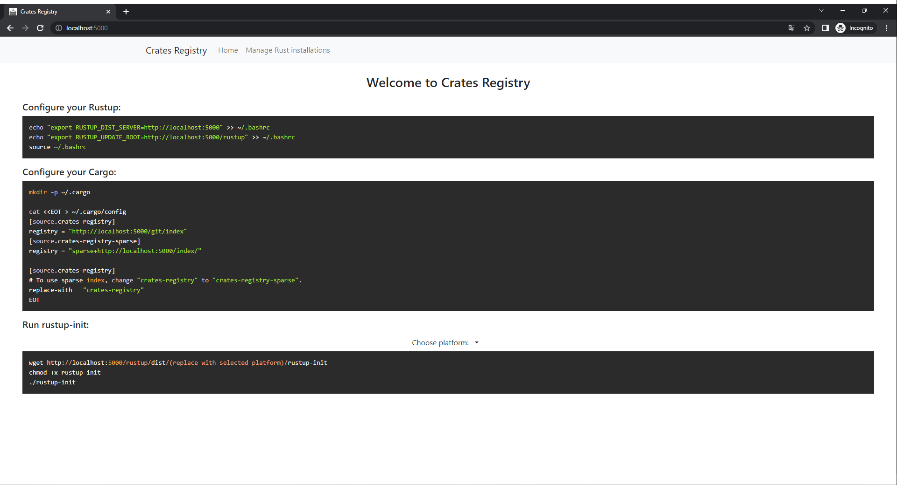

# Crates Registry
  
[](https://crates.io/crates/crates-registry)
[](https://hub.docker.com/r/talroni/crates-registry)
## Description

Crates Registry is a tool for serving and publishing crates and serving rustup installation in offline networks. (like Verdaccio as npm registry)
The project partially uses code from these open source projects: [panamax project](https://github.com/panamax-rs/panamax) and [cargo-http-registry](https://github.com/d-e-s-o/cargo-http-registry) and they deserve credit accordingly.



## Installation
Crates Registry can be installed with cargo:
```bash
$ cargo install crates-registry
```
Also available in docker (recommended for serving use):
```bash
$ docker run -d --name crates-registry -e RUST_LOG=info -v /path/to/mirror-folder:/registry -p 80:80 crates-registry:latest serve -s <server ip> --root-registry /registry 
```
(Modify /path/to/registry port and server-IP as needed)

## Usage
There are several possible uses:
* [Packing](#packing) - Pack rust installation in the online network.
* [Unpacking](#unpacking) - Unpacking new rust installation into the registry folder (also possible through the UI).
* [Serving](#serving) - Serve the registry in your offline network.

### Packing
Packing rust installations on the online side to serve later in the offline network.
We download the rust installations in self-contained directories and pack the directory in tar file.
packing example:
```bash
$ crates-registry pack --pack-file packed_file.tar --rust-versions 1.67.1,04-03-2023-nightly --platforms x86_64-unknown-linux-gnu
```
Run `crates-registry pack --help` for all available options.

### Unpacking
Unpack the packed file that contains the rustup installations in the registry folder.
You can load the tar file through the UI at http://server-adress/manage-installations. Follow the instructions in the page.
Another option is to load the tar file using the unpack command:
```bash
$ crates-registry pack --packed-file /packed_file.tar --root-registry /path/to/registry/folder
```

### Serving
The Crates Registry provides an HTTP server that can handle serving the crates and rustup installations fast and at scale.
serving example:
```bash
$ docker run -d --name crates-registry -e RUST_LOG=info -v /path/to/mirror-folder:/registry -p 80:80 crates-registry:latest serve -s <server ip> --root-registry /registry 
```
(Modify /path/to/registry port and server-IP as needed)
Run `crates-registry serve --help` for all available options.

## Configuring your environment
Once you have a server set up and running, it's time to tell your rust components to use it.

### Setting environment variables
To ensure rustup knows where to look for the Rust components, we need to set some environment variables. Assuming the server is hosted at http://crates.registry/:
```bash
export RUSTUP_DIST_SERVER=http://crates.registry
export RUSTUP_UPDATE_ROOT=http://crates.registry/rustup
```
These need to be set whenever rustup is used, so these should be added to your .bashrc file (or equivalent).

### Rustup
To install `rustup` you can download the rustup-init file. The `rustup-init` file you want depends on your architecture. Assuming you're running desktop Linux on a 64-bit machine:
```bash
wget http://crates.registry/rustup/dist/x86_64-unknown-linux-gnu/rustup-init
chmod +x rustup-init
./rustup-init
```
This will let you install rustup the similarly following the steps from https://rustup.rs. This will also let you use rustup to keep your Rust installation updated in the future.

### Cargo
Cargo also needs to be configured to point to the mirror. This can be done by adding the following lines to ~/.cargo/config (creating the file if it doesn't exist):
```toml
[source.my-mirror]
registry = "http://crates.registry/git/index"
[source.crates-io]
replace-with = "my-mirror"

# For publish crates.
[registries]
my-registry = { index = "https://crates.registry/git/index" }

```
Cargo should now be pointing to the correct location to use the mirror.

## Import crates to the registry.
Tow utilities to import new crates:
* [cargo-collect](https://gitlab.com/TalRoni/cargo-collect) - Collect crate and its dependencies recursively.
* [cargo-upload](https://gitlab.com/TalRoni/cargo-upload) - Upload crate files to the registry.

You can also publish crates using the `cargo publish` command.

## License
Licensed under the terms of the GNU GENERAL PUBLIC LICENSE Version 3 and the Apache License (Version 2.0)
